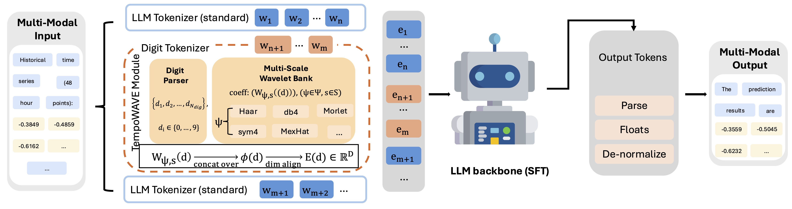

<div align="center">

# TempoWAVE

### Speaking Numbers to LLMs: Multi-Wavelet Number Embeddings for Time Series Forecasting

Defu Cao<sup>1*</sup>, Zijie Lei<sup>1*,2</sup>, Muyan Weng<sup>1</sup>, Jiao Sun<sup>1,3</sup>, Yan Liu<sup>1</sup>

<sup>1</sup>University of Southern California &nbsp;·&nbsp; <sup>2</sup>Meta &nbsp;·&nbsp; <sup>3</sup>Google DeepMind

<sub><sup>*</sup> Equal contribution.</sub>

<em>IJCAI–ECAI 2026</em>

[](https://arxiv.org/abs/2606.26487)
[](https://huggingface.co/Melady/TempoWAVE)
[](https://github.com/DC-research/TempoWAVE)
[](LICENSE)

</div>

---

TempoWAVE gives an LLM a numerically grounded digit interface. Each decimal
digit is routed through one of ten dedicated tokenizer tokens and initialized
from a multi-wavelet, multi-scale codebook. Text, signs, decimal points, and
separators continue to use the base model's standard embeddings.

> **TL;DR.** The discrete, language-oriented token interface of LLMs is
> misaligned with continuous numerical values, which harms numerical ordering
> and forecasting reliability. TempoWAVE is a plug-and-play temporal wavelet
> digit interface that maps each scalar observation into digit-wise embeddings
> built from multi-wavelet, multi-scale coefficients. By directly overriding
> standard token representations, it exposes both fine-grained local
> fluctuations and macro global structure in a transformer-compatible form,
> achieving a new state of the art across five context-enriched forecasting
> benchmarks.

<div align="center">

<p><em>Overview of the TempoWAVE-based forecasting framework. The input prompt is tokenized once with a tokenizer augmented with dedicated digit tokens. Text and context tokens use standard embeddings, while digit tokens are routed to the TempoWAVE module, which constructs digit embeddings via multi-wavelet, multi-scale coefficients and overrides the corresponding token embeddings. The resulting sequence is fed into an unchanged LLM backbone trained via supervised fine-tuning (SFT). Generated numeric tokens are parsed, de-normalized, and evaluated as real-valued forecasts.</em></p>
</div>

## Links

| Resource | Link |
| --- | --- |
| 📄 Paper | [arXiv:2606.26487](https://arxiv.org/abs/2606.26487) · [PDF](https://arxiv.org/pdf/2606.26487) |
| 🤗 Model | [Melady/TempoWAVE](https://huggingface.co/Melady/TempoWAVE) |
| 💻 Code | [DC-research/TempoWAVE](https://github.com/DC-research/TempoWAVE) |

## Paper Method

For a fixed-precision value such as `-0.5000`, the repository renders each
digit as an individual token:

```text
-<|digit_0|>.<|digit_5|><|digit_0|><|digit_0|><|digit_0|>
```

For each digit `d` in `{0,...,9}`, TempoWAVE:

1. maps `d` to `d / 9` on a fixed grid;
2. samples each scaled mother wavelet at the digit's impulse location;
3. concatenates coefficients across wavelets and scales;
4. maps that vector to the LLM embedding dimension; and
5. replaces only the corresponding digit-token embedding row.

The canonical configuration uses Qwen2.5-1.5B-Instruct, Haar, db4, and Mexican
Hat wavelets, and scales `1`, `2`, and `4`. The implementation checks that all
ten digit codewords are distinct. Because Qwen ties its input and output
embeddings by default, TempoWAVE explicitly separates them before freezing the
input codebook. The language-model head remains trainable so it can generate
the new digit tokens.

## Repository Layout

```text
configs/                    Canonical initialization, training, and eval configs
data/benchmark_registry.py  Supported test sets and primary references
data/prepare_benchmarks.py  Official-split benchmark conversion
data/prepare_finetune.py    Context-aware prompt and SFT formatting
training/embeddings/        Digit codebook and tokenizer/model injection
training/pretrain.py        TempoWAVE initialization and optional LM pretraining
training/continuous_pretrain.py
training/finetune.py        Response-only forecasting SFT
evaluation/                 Fixed-precision generation, parsing, MAE, and RMSE
examples/                   Tiny schema fixtures
tests/                      Lightweight algorithm and data-contract tests
```

## Setup

```bash
conda env create -f environment.yml
conda activate tempowave
```

The training environment targets Linux with an NVIDIA GPU and CUDA 12.1.
Run commands from the repository root.

## Benchmark Data Workflow

The paper evaluates AUL, BIT, MSPG, PTF, and LEU. AUL and BIT are distributed
with [From News to Forecast](https://github.com/ameliawong1996/From_News_to_Forecast);
MSPG, PTF, and LEU are available from the
[CGTSF dataset](https://huggingface.co/datasets/ChengsenWang/CGTSF) introduced
with [ChatTime](https://github.com/ForestsKing/ChatTime). Prepare their official
records as a JSON list with explicit `dataset`, `split`, normalized `history`,
normalized `target`, and the available context:

```json
[
  {
    "split": "train",
    "dataset": "AUL",
    "history": [-0.3849, -0.4859, -0.6162],
    "target": [-0.7185, -0.7001],
    "situational_context": "Region VIC; prediction date 2021-05-13...",
    "news": "Relevant event text...",
    "catch22": {
      "CO_f1ecac": 4.6154
    },
    "normalization": {
      "kind": "identity"
    }
  }
]
```

Preserve the source dataset's official `train`, `val`, and `test` labels:

```bash
python -m data.prepare_benchmarks \
  --input_file data/raw/official_records.json \
  --output_dir data/processed \
  --pred_len 48 \
  --compute_missing_catch22
```

When normalized values need to be mapped back to the benchmark's original
units, include affine metadata and optionally `raw_history`/`raw_target`:

```json
{
  "normalization": {
    "kind": "affine",
    "offset": 7000.0,
    "scale": 4000.0,
    "normalized_offset": -0.5
  }
}
```

See [DATA.md](DATA.md) for the complete contract.

## Model Pipeline

### 1. Initialize TempoWAVE

Run the paper's digit-codebook injection:

```bash
python -m training.pretrain \
  --config configs/pretrain.yaml
```

This writes an initialized local model to the `output_path` configured in
`configs/pretrain.yaml`.

### 2. Forecasting SFT

```bash
python -m training.finetune --config configs/sft.yaml
```

SFT uses the historical digit sequence together with situational context,
news, and Catch22 descriptors when present. Loss is restricted to the
assistant response.

### 3. Evaluation

```bash
python -m evaluation.run_eval \
  --config configs/eval.yaml \
  --model_path outputs/sft/Qwen2.5-1.5B-Instruct_tempowave \
  --input_file data/processed/eval/eval.json
```

Evaluation parses dedicated digit tokens, applies a deterministic plain-number
fallback, reverses each record's normalization, reports invalid numeric
coverage, and computes MAE and RMSE. Evaluation fails by default when a value
remains invalid after fallback parsing, preventing malformed forecasts from
being silently omitted from reported metrics.

## Additional Language-Model Pretraining

The repository also supports language-model pretraining before forecasting
SFT:

```bash
python -m training.pretrain \
  --config configs/pretrain.yaml \
  --train_language_model

python -m training.continuous_pretrain \
  --config configs/continuous_pretrain.yaml
```

Both commands expect a CSV with a `text` column already formatted with the ten
digit tokens. To use the continuous-pretrained model for SFT, override
`--model_path` when running `training.finetune`.

## Verification

```bash
python -m unittest discover -s tests
ruff check .
python -m compileall -q .
bash -n training/pretrain.sh
bash -n training/continuous_pretrain.sh
bash -n training/finetune.sh
bash -n evaluation/run_eval.sh
```

## Citation

If you use TempoWAVE, please cite our paper:

```bibtex
@inproceedings{cao2026tempowave,
  title     = {Speaking Numbers to {LLM}s: Multi-Wavelet Number Embeddings for Time Series Forecasting},
  author    = {Cao, Defu and Lei, Zijie and Weng, Muyan and Sun, Jiao and Liu, Yan},
  booktitle = {Proceedings of the Thirty-Fifth International Joint Conference on Artificial Intelligence (IJCAI-ECAI)},
  year      = {2026}
}
```

## License

Released under the [MIT License](LICENSE).
